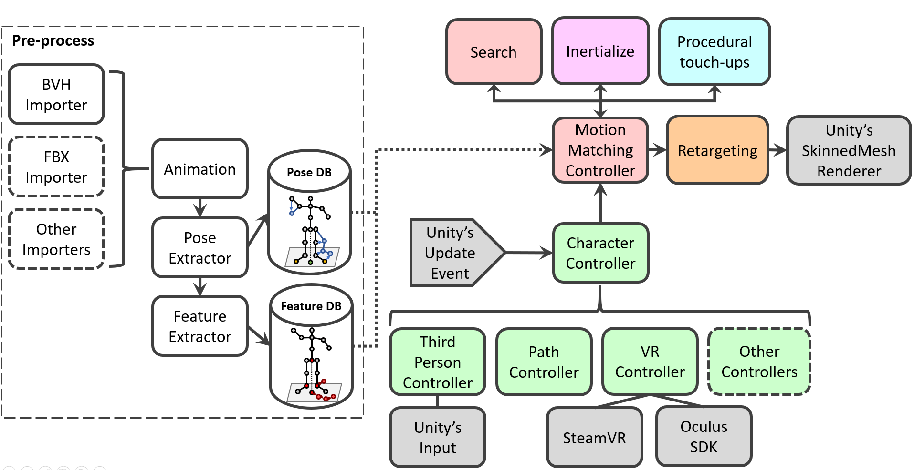
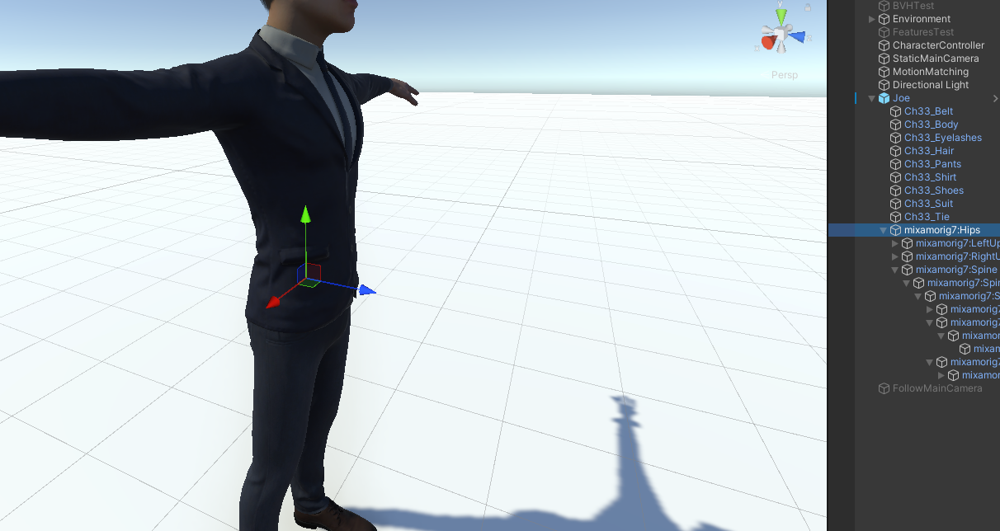
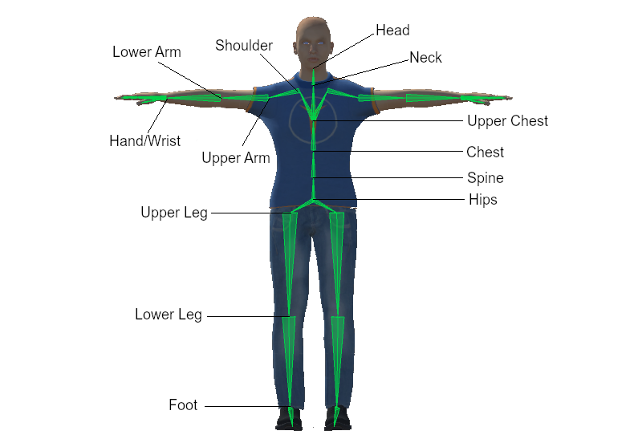

# Motion Matching


**Motion Matching** implementation for the **Unity** game engine. This project is part of my master thesis, which you can download [here](.github/pdfs/Master_Thesis_JoseLuis.pdf) to obtain a detailed description of both Motion Matching and this project. I intend to update this project in my spare time, adding more features until it is a complete Motion Matching solution for Unity. For now, it may be useful for those wanting to learn/implement their own Motion Matching solution or extend this project. For a Virtual Reality version of Motion Matching, please visit [this paper](https://upc-virvig.github.io/MMVR/).

## Contents

1. [Structure](#structure)
2. [Quick Start](#quick-start)
3. [How to Use](#how-to-use)
4. [Roadmap](#roadmap)
5. [Citation](#citation)
6. [Acknowledgments](#Acknowledgments)
7. [License](#license)

## Structure

This section defines the project's structure and where to find data, scripts, etc. For practical instructions on using the project, go to [How to Use](#how-to-use).

The Unity project can be found in the ``MotionMatchingUnity`` directory, and the ``MotionMatchingUnity/Assets`` folder contains all scripts and data. From this point on, all directories and files will be specified relative to this ``Assets`` folder.

The ``Animations`` folder contains the motion capture (MoCap) files (*.bvh* files with the extension changed to *.txt* ) and the *MMData* files, which define an animation database to be used by the Motion Matching System.

Most of the code is located in the ``MotionMatching`` folder grouped into the *MotionMatching* namespace. Please, refer to my [master thesis](.github/pdfs/Master_Thesis_JoseLuis.pdf) for a comprehensive explanation of some Motion Matching concepts. In this directory, you will find all the code needed to import *.bvh* files, the pose and feature databases, the motion matching search, character controllers, inertialization, etc.  The following image shows an overview of the code's architecture:



Finally, ``StreamingAssets/MMDatabases`` contains the processed pose and feature database and some skeletal information. This folder is automatically created when computing a new *MMData* file.

## Quick Start

1. Clone this repository

2. Install **Unity 2021.2.13f1** (other versions may work but are not tested)

3. Open the project and navigate to the `Assets/Scenes` folder and choose either `JLSceneTest` (FinalIK required) or ``JLScenePathTest``.

Demo scenes consist of two major GameObjects: a Character Controller and the MotionMatchingController:

Character Controllers are responsible for creating the trajectories and enforcing some positional constraints, such as the maximum distance between the simulated and animated character positions.

MotionMatchingController executes all Motion Matching-related code. It exposes some parameters allowing enabling/disabling some features such as inertialize blending or foot lock.

## How to Use

##### How to create an animation database (*MMData*)

Animation databases contain all motion that Motion Matching will use to animate the character. They are defined through the MotionMatchingData (*MMData*) scriptable object. You can find an example of an *MMData* at ``Animations/MMData/JLData.asset``.

1., Add one or several *.bvh* files to the project. Change their extension to *.txt* so Unity recognizes them as *Text Assets*.

2. Right-click onto the Project window and select ``Create/MotionMatching/MotionMatchingData``. 
   
   > You can also duplicate the *MMData* at ``Animations/MMData/JLData.asset`` and use it as a template.

3. Press *Add BVH* and reference the *.bvh* (I will refer to them as *.bvh* files although we changed their extension to *.txt*) file. In the following field *BVH with TPose* reference a *.bvh* file in which the first frame the character is in T-Pose. The skeleton should be the same in all *.bvh*, and you can use the same *.bvh* as before if it contains in the first frame a T-Pose.

4. Select the scale of the *.bvh* file and the local vector pointing forward of the hips/root joint. For example, in the following image, this is the Z-axis (0, 0, 1):
   
   > Make sure you have the *Gizmo handle position toggle* in local space. [More Info](https://docs.unity3d.com/Manual/PositioningGameObjects.html).
   > 
   > The skeleton in your *.bvh* may be different from the one in your virtual character. You must introduce the forward vector of the *.bvh* root joint.
   
   

5. The contact velocity threshold is used to determine the foot contact labels for the foot lock. You can ignore it for now.

6. Press *Read Skeleton from BVH* and unfold the *Skeleton to Mecanim* field. This is a mapping of the bones found in the *.bvh* skeletal information to Unity's animation system. Some bones may be mapped based on their names; however, please review carefully (automatic assignment is only based on name) and assign all bones that have a corresponding mapping in Unity. If any bone is not represented in Unity's animation system, you can map it as *Last Bone* and it will be ignored. An example of a Unity skeleton:
   
   

7. Unfold the *Feature Selector* menu and select trajectory and pose features. This project provides a fully customizable pose and trajectory features for Motion Matching. However, at its current state, modifications on the trajectory features require some coding, such as changing the character controller. Feel free to read the code and experiment with this, but for a first test, simply copy the trajectory features found in ``Animations/MMData/JLData.asset``. 

8. Press *Generate Databases* and done! This will create the processed pose and features databases in the ``StreamingAssets/MMDatabases`` directory.

##### How to animate a character with Motion Matching

Motion Matching is defined by the character controller and the motion matching controller. The former gets input from the user and creates trajectories and features. The latter handles all databases, the motion matching search and some pose postprocessing. Finally, since this project does not use Unity's animation system for Motion Matching, there is a last step that retargets the resulting skeleton to Unity's system for rendering.

1. Create an animation database (*MMData*) following the [previous steps](#how-to-create-an-animation-database-(MMData)).

> Use the demo scene ``Scenes/JLTest/JLSceneTest.unity`` as template.

2. Add a Character Controller component (currently, SpringCharacterController or PathCharacterController) to an empty GameObject. Reference (Simulation Bone) the component created in Step 3. Do not change the names of the features unless you modify them when creating a new *MMData*.

3. Add a Motion Matching Controller component to an empty GameObject. Reference the Character Controller and an *MMData* file.

4. Add an avatar to the scene (use ``Graphics/Models/Joe/Joe.prefab``as reference). It should be imported as humanoid. Add a Motion Matching Skinned Mesh Renderer component, reference the motion matching controller and specify the forward local vector of the character's root joint (as Step 4 of the [how to create](#how-to-create-an-animation-database-(MMData)) *MMData* instructions). 

5. Press Play!

## Roadmap

Here, I write some of the features I want to add/improve in the future. This is a side project, so dates are not specified.

- Improve documentation explaining Motion Matching concepts (you can read my [master thesis](.github/pdfs/Master_Thesis_JoseLuis.pdf) for now).

- User-friendly trajectory feature modification and more types of pose features.

- BVH editor with tagging system (with real-time complex tag queries).

- Record more motion capture data and default avatars to use right away.

- Upgrade PathCharacterController (right now, the path tools are too hardcoded... use splines and more interesting approaches).

- Integrations tools/methods with Unity's animation system. (Allow seamless integration between systems. For example, use Unity's animation system for the upper body and motion matching for the lower body).

- Restructure the project into a Unity package for easy distribution and integration.

- Visual debugging tools.

- Include deep learning to reduce memory usage.

## Citation

If you find this project useful, please include an attribution to this repository or cite my master thesis:

```
@mastersthesis{ponton2022mm,
  author  = "Ponton, Jose Luis",
  title   = "Motion Matching for Character Animation and Virtual Reality Avatars in Unity",
  school  = "Universitat Politecnica de Catalunya",
  year    = "2022"
}
```

## Acknowledgments

I want to thank [Daniel Holden](https://theorangeduck.com/) for his comprehensive articles about data-driven animations, and his paper [Learned motion matching](https://dl.acm.org/doi/abs/10.1145/3386569.3392440) which encouraged me to start researching about character animation and creating this project.

## License

This work by Jose Luis Ponton is licensed under [CC BY 4.0](http://creativecommons.org/licenses/by/4.0/?ref=chooser-v1)
